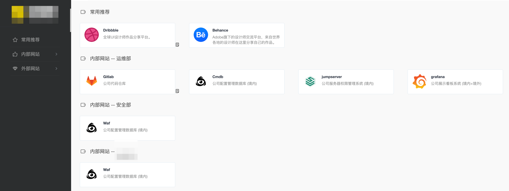

### 一：项目介绍


静态导航页面

```
来源: https://webstack.cc/cn/index.html
模仿: https://github.com/Anjaxs/WebStack-vue/tree/master
```


#### 二：迁移启动
```
cd vue
yarn install
yarn serve
yarn run build
```


#### 三：界面展示

